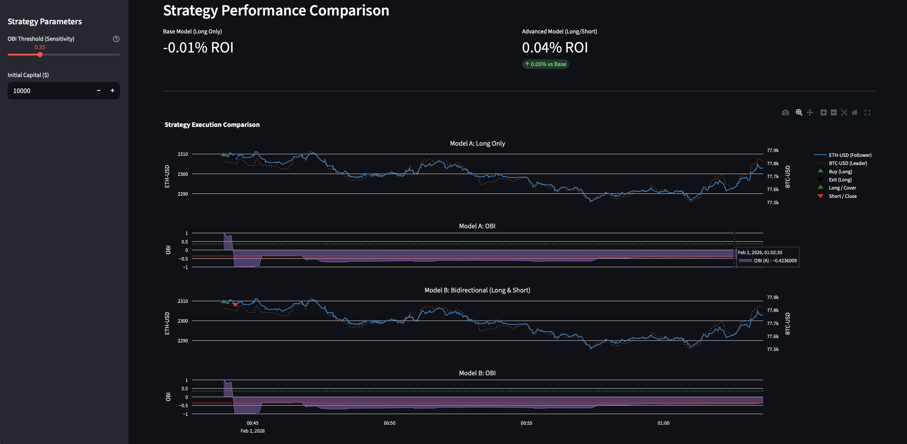
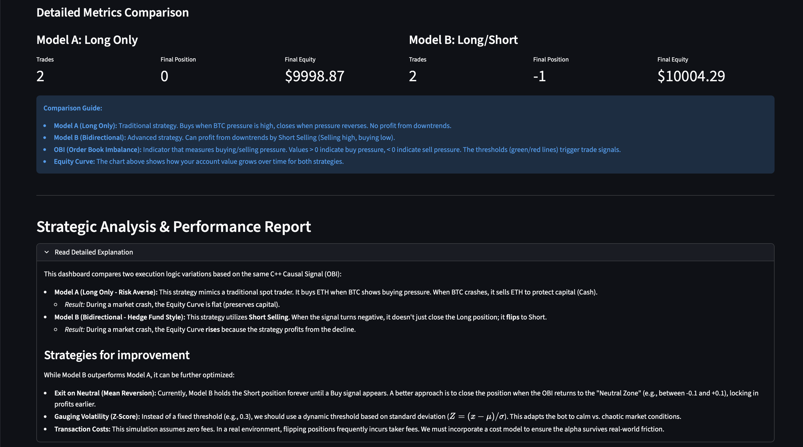
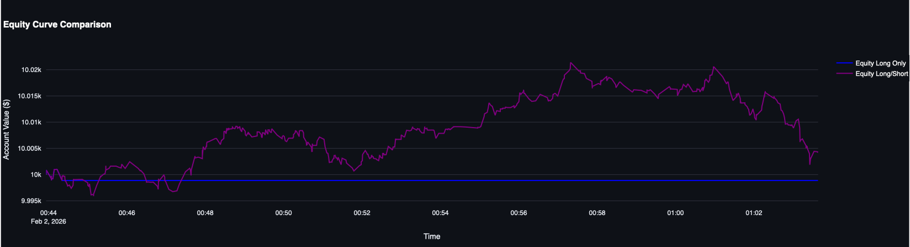

# High-Frequency Causal Engine (HFT)


> 🚧 **Project Status:** Research Prototype (Alpha). Optimized for local backtesting and simulation. Not production-ready for live capital execution.

An **Event-Driven Hybrid Trading Engine** engineered for ultra-low latency crypto arbitrage.
It combines a **C++ Core** for high-performance signal generation with a **Python** orchestration layer for backtesting and visualization. The system detects **Lead-Lag relationships** between correlated assets (e.g., BTC/ETH) using Order Book Imbalance (OBI).

---

## Dashboard Preview

> **Strategic Insight:** The dashboard visualizes the "Lead-Lag" effect where Bitcoin's order book pressure (purple area) anticipates Ethereum's price movement (blue line).


*(Above: Comparison between "Long Only" Model A and "Bidirectional Short Selling" Model B)*

---

## System Architecture

The architecture follows a strict **Event-Driven** pattern to eliminate look-ahead bias. Data flows from raw exchanges into a normalized DuckDB storage, processed tick-by-tick by the C++ engine.


---

## Key Features

* **Hybrid C++/Python design:**
    * **C++ core:** Optimized `OrderBook` class using `std::unique_ptr` and memory-aligned structures for signal calculation in **< 5 microseconds**.
    * **Python bindings:** Seamless integration via `pybind11` allowing rapid prototyping with C++ speed.
* **Event-Driven backtesting:**
    * Replays historical market data tick-by-tick to eliminate look-ahead bias.
    * Simulates realistic latency and order execution constraints.
* **Bidirectional strategy:**
    * Supports **Short Selling**.
* **Efficient data engineering:**
    * Uses **DuckDB** for high-performance OLAP queries on tick data.
    * Standardized schema adaptable to Stocks, Forex, or Crypto.

---

## Quantitative Strategy

The engine exploits market microstructure inefficiencies using **Order Book Imbalance (OBI)** as a predictor for short-term price movements.



*(Above: The engine's automated breakdown of the "Long/Short" logic and Equity Curve analysis)*

--- 

## Signal Generation (OBI)
We calculate the pressure on the Order Book of the *Leader Asset* (e.g., BTC). A high OBI indicates aggressive buying pressure.

$$OBI_t = \frac{V_t^{bid} - V_t^{ask}}{V_t^{bid} + V_t^{ask}}$$

Where $V_t^{bid}$ is the volume at the best bid and $V_t^{ask}$ is the volume at the best ask.

---

## Extensibility & Asset-Agnostic Design

This engine is designed with a **modular architecture** where the C++ Core is completely **agnostic to the asset class**. While the default configuration uses Crypto (BTC/ETH), the logic is universally applicable to any correlated pair (e.g., Equity Pairs like KO/PEP or Forex pairs like EURUSD/GBPUSD).

To test the engine with your own dataset (Stocks, Futures, Forex), you only need to satisfy the **Data Contract**:

### 1. Data Ingestion ([src/engine/data_loader.py](src/engine/data_loader.py))

Modify the `fetch_and_store` method to ingest your specific data source (e.g., CSV files, different APIs, or Parquet files). The pipeline requires a Pandas DataFrame with the following normalized schema:

| Column | Type | Description |
|--------|------|-------------|
| `symbol` | `str` | Ticker identifier (e.g., "AAPL", "EUR-USD") |
| `timestamp` | `datetime` | Precise time of the trade |
| `price` | `float32` | Execution price |
| `quantity` | `float32` | Volume traded |
| `side` | `str` | Aggressor side: `'buy'` or `'sell'` |

### 2. Strategy Configuration ([src/run_backtest.py](src/run_backtest.py))

Update the symbol selection logic in the orchestration script to identify your new Leader and Follower assets:

```python
# Example: Switching from Crypto to Tech Stocks
leader_symbol = "NVDA"  # Leader
follower_symbol = "AMD"  # Follower
```

The **C++ Engine** (`engine_core`) requires **no modification** to process new asset classes, as it operates purely on abstract order flow data.


---

## Installation & Usage

### Prerequisites
* Python 3.10+
* C++ Compiler (GCC/Clang/MSVC)
* Poetry (Dependency Manager)

### 1. Clone & Install
```bash
git clone [https://github.com/dangolofrancesco/high-freq-causal-engine.git](https://github.com/dangolofrancesco/high-freq-causal-engine.git)
cd high-freq-causal-engine
poetry install
```

### 2. Build the optimized C++ OrderBook module using pybind11:

```bash
poetry run python setup.py build_ext --inplace
```

### 3. Fetch the sample tick data and launch the interactive dashboard:
The data loader fetches public historical tick data (Trades/OHLCV) via ccxt. No API keys are required for fetching public market history.

```bash
# 1. Ingest Data (Kraken/Simulated)
poetry run python src/engine/data_loader.py
```
_By default, this downloads the latest tick data for BTC/USD and ETH/USD from Kraken._

```bash
# 2. Launch Dashboard
poetry run streamlit run src/dashboard.py
```

**Note:** The dashboard will open automatically in your browser at http://localhost:8501

--- 

## Performance Benchmarks

**Backtest Context:**
* **Period:** High-volatility window (1 Hour sample)
* **Data Granularity:** Tick-by-tick (Real Trades)
* **Exchange:** Kraken (BTC/USD vs ETH/USD)

| Metric | Result |
| :--- | :--- |
| **Mean Latency per Tick** | **4.49 µs** |
| **P99 Latency** | 33.42 µs |
| **Throughput** | ~220,000 ticks/sec |
| **ROI (Sample Period)** | +0.05% (vs Buy & Hold -0.12%) |

---
## Quick Start (End-to-End Example)
Want to test the engine logic without running the full dashboard? Here is a minimal 5-line example:

```python
import engine_core

# 1. Initialize Strategy with Sensitivity Threshold 0.3
strategy = engine_core.PairStrategy(0.3)

# 2. Feed a "Buy" Tick for the Leader Asset (Symbol 0 = BTC)
# Args: (SymbolType, Price, Quantity, IsBid)
strategy.on_market_data(0, 50000.0, 1.5, True) 

# 3. Check for Signals on the Follower Asset
signal = strategy.check_signal() 

print(f"Engine Signal: {signal}") # Output: 1 (Buy), -1 (Sell), or 0 (Hold)
```

---
## License
Distributed under the MIT License. See LICENSE for more information.


## ⚠️ Legal Disclaimer

**EDUCATIONAL SOFTWARE ONLY.**
This software is a research prototype designed for analyzing market microstructure and testing high-frequency trading logic.
* **No Financial Advice:** Nothing in this repository constitutes financial investment advice.
* **Risk Warning:** Cryptocurrency trading involves substantial risk of loss.
* **Use at Your Own Risk:** The authors accept no liability for any financial losses incurred through the use of this software. Past performance in backtests is not indicative of future results in live markets.

